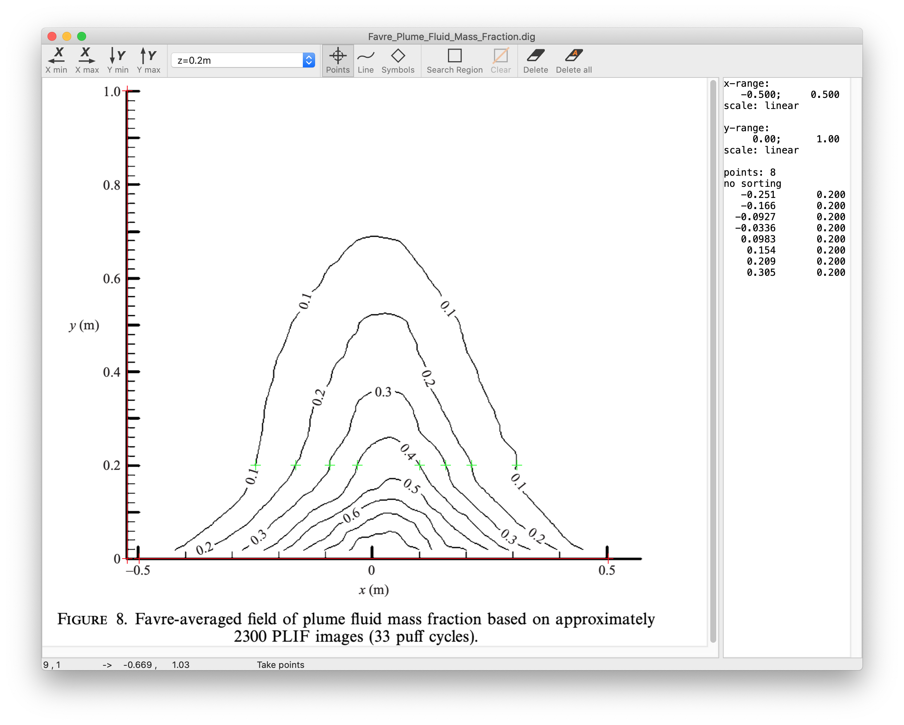

From the following reference:

T. J. O’Hern, E. J. Weckman, A. L. Gerhart, S. R. Tieszen and R. W. Schefer, Experimental study of a turbulent buoyant helium plume, J. Fluid Mech., (2005), vol. 544, pp. 143–171.

The data was digitized with a software tool called [DigitizeIt](https://www.digitizeit.xyz/).  The `*.dig` files are committed and may be examined with this software.  Below we show an example of the Favre plume fluid mass fraction data at z=0.2 m above the surface from the digitization software.  Points were extracted along the isocontours of mass fraction and stored in `*.csv` files.

The images are taken from the above reference for both Reynolds and Favre averaged data.  It can clearly be seen that the Sandia Helium Plume data that we have stored in the MaCFP/macfp-db data repository is **Favre Averaged**.

The next question to be addressed was whether the data for the "helium" mass fractions were for pure helium or for the "plume mixture" which according to the reference is 1.7 vol% Acetone, 1.9 vol% Oxygen, and remainder helium (average mole wt of 5.45 g/mol)---thus, the pure helium volume fraction is 0.964.  With the mole wt of pure helium taken as 4 g/mol, the mass ratio between pure helium and plume fluid is 4/5.45 * 0.964 = 0.7075.  In the plots showing He mass fraction we have applied this ratio to the data extracted for the plume fluid from O'Hern et al.  Unfortunately, this is the one dataset that is still ambiguous, as the data we have in this repository seems to fall in between the plume fluid and pure helium curves.